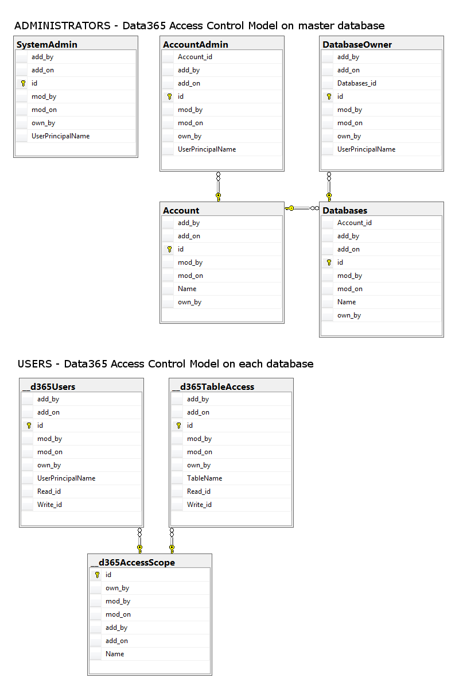

# Overview

Data365 provides access control through the Azure Active Directory service. Users will need to first authenticate against AAD before being able to access any data. 

Once authenticated, all calls to the API will bear a security token identifies the user including ownership to security groups relevant to Data365.

Authorization is given by a role-based model implemented inside Data365.

# Authentication through AAD

You can read more about AAD security tokens and claims [here](https://docs.microsoft.com/en-us/azure/active-directory/develop/active-directory-token-and-claims). We are using OpenID Connect and the associated JWT Id_token. 

The security token encodes the following fields relevant to the Data365 security model:

```json
{
  "upn": "dkottow@golder.com",
  "groups": [
    "0e129f6b-6b0a-4944-982d-f776000632af",
    "323b13b3-1851-4b94-947f-9a4dacb595f4",
    "6e32c250-9b0a-4491-b429-6c60d2ca9a42"
  ]
}
```

* `upn` User Principal Name, corresponds to our AAD user.
* `groups` GUID's identifying AAD groups. Note that AAD will only include groups that have been previously assigned to the Data365 application manifest in AAD.

Data365 will define **a single security group for all database admins** (users that may alter database structures). This is an additional security layer; users with admin rights will have to belong to this AAD group and in adddition be defined as administrators on particular accounts / databases as described below.

# Admin Roles

We define the following admin roles.

## System Admin

A system admin has full access to all accounts. It is the only security role allowed to create new accounts.

## Account Admin

An account admin is bound to a certain account; he has full access to the collection of databases belonging to it. Only account admins can create new databases.

## Database Admin

A database admin is bound to a certain database; he has full access to all data in the database. Only database admins can execute schema change methods (resulting in DDL statements).

# Normal Users

## Data Access Permissions

For regular users we define permission levels to read and write data. There are different variants of read and write access which rely on a row ownership model. All tables in Data365 have an `own_by` field to establish the owner of each row. Based on the row ownership, Data365 distinguishes three row scoping modifiers - `all`, `own` and `none` - which are combined with the access mode (read-only / read-write) providing the following permissions:  

### Read Only 
* `read: none, write: none`
* `read: own, write: none`
* `read: all, write: none`

### Read Write 
* `read: own, write: own`
* `read: all, write: own`
* `read: all, write: all`

Data access permissions are defined at the database level, but may be overwritten by an explicit table level permission. 

### Table Level Permission

A table level permissions can have the same values as the user or group permissions defined at the database level. To determine the resulting permission for a particular table and user, the table level permission is combined with the user's (or group's) database-level permission using the following rules. 

| User | Table | Result |
| --- | ----- | ------ |
| none | * | none |
| own | none | none |
| all | none | none |
| own | own | own |
| all | own | own |
| own | all | all |
| all | all | all |

Notes: Read and write permissions obey the same table-level overwrite rules.

### Ownership Column
The ownerhip field `own_by` is a user (upn value). It can also be `null` which means anybody with `all` or `own` read (write) access to the table can act on such a row; only users with `none` permission will be denied access.

# SQL Model 

All user access control definitions are stored on Data365 tables. This allows for comfortable user and access management using Data365's data browser provided the user has proper database admin rights or has been granted acces to appropriate tables.

Admin access rights - from sys admin to database owner - are defind inside Data365's "master" database to which only admin's themselves have access.

Normal database users are managed inside each database using a few system tables. By default, only database owners and superior have write access to this table.



## Implementation Notes

A rule stating that only `own` rows can be written is implemented as permission to:

* Insert rows
* Update and Delete own rows (inserted by the user).

A rule stating that only `own` rows may be read is implemented by:

* All Select queries filter out rows not owned by the user. 

`all` and `none` implementations are straightforward.


